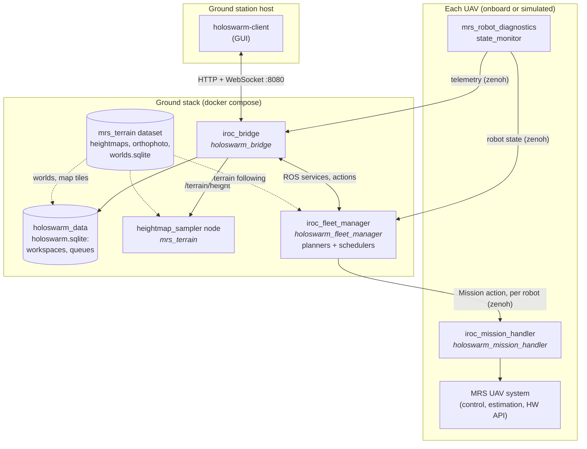

# Ground station setup for experiments and simulation

The holoswarm ground station runs multi-UAV missions on the [MRS UAV system](https://github.com/ctu-mrs/mrs_uav_system). It consists of the fleet manager (mission planners and schedulers), the HTTP/WebSocket bridge, a terrain sampler and a GUI. Everything except the GUI runs in docker compose. The same setup drives a local simulation or real UAVs.

## Getting started

### Dependencies

- Ubuntu 24.04 (other Linux distributions with docker should work too)
- Docker with the compose plugin:
  ```bash
  bash <(curl -fsSL https://raw.githubusercontent.com/ctu-mrs/mrs_docker/master/install/install_docker_ubuntu.sh)
  ```
- git with SSH keys for GitHub and for `mrs.fel.cvut.cz`. `holoswarm_ros_packages` and its `holoswarm_*` submodules are private repositories there.
- python3 ≥ 3.11 with `venv`, and curl
- Optional:
  - [tmuxinator](https://github.com/tmuxinator/tmuxinator) for `./tmux/start.sh`
  - [lazydocker](https://github.com/jesseduffield/lazydocker) to watch the containers
  - ROS 2 Jazzy on the host for rviz

### Install

```bash
git clone --recursive git@github.com:matias-v441/ground_setup.git
cd ground_setup
./setup.sh
```

`setup.sh` is safe to run again, e.g. after pulling. It checks out the submodule commits recorded here, so if you have submodule work, commit it and the new submodule pointer first. It does the following:
1. Checks the dependencies.
2. Checks out all submodules at their pinned commits.
3. Downloads the PROJ grids into `.proj/`.
4. Builds `holoswarm_ros_packages` with colcon inside the `ctumrs/mrs_uav_system:stable` image (`compose/build.sh`).
5. Installs the GUI into `holoswarm-client/.venv`.

After changing ROS code, rebuild with `./compose/build.sh`.

### Run in simulation

```bash
./compose/up.sh simulation      # ground stack + mrs_multirotor_simulator with uav14 and uav16, which take off
cd holoswarm-client && .venv/bin/holoswarm-client --workspace temesvar
./compose/down.sh               # stop everything (any mode)
```

- The UAVs and world are configured in `compose/simulation/config/` and `compose/modes/simulation.env` (`SIM_UAVS`, `WORLD_CONFIG`; the default world is `config/worlds/world_temesvar_field_123.yaml`).
- `SIM_UAVS="uav14" ./compose/up.sh simulation` runs only some of the UAVs.
- `SIM_TAKEOFF=0` keeps them on the ground.
- To see the containers and their logs, run `lazydocker`. To get a shell in one with the workspace sourced, run `./compose/connect.sh <project> <service>` (e.g. `./compose/connect.sh uav14 core`).

### Run as an experiment

The UAVs run the MRS UAV system together with `iroc_mission_handler` and `mrs_robot_diagnostics` from `holoswarm_ros_packages` (branch `buninmat-ground-setup`). The ground station reaches them over zenoh.

1. Put the UAV names in `config/network_config.yaml` (`robot_names`).
2. Put their zenoh router addresses in the `connect.endpoints` of `config/zenoh/pc_router.json5`, e.g. `tcp/192.168.69.114:7447`.
3. Start the ground stack:
   ```bash
   ./compose/up.sh experiment
   cd holoswarm-client && .venv/bin/holoswarm-client --workspace temesvar
   ```
   or `./tmux/start.sh`. It opens a tmux session with the experiment-mode compose stack, lazydocker, rviz (`config/rviz/`) and the client.

### All modes

| Mode | `./compose/up.sh …` | What runs |
| --- | --- | --- |
| `simulation` | local simulation | ground stack + simulator + one onboard stack per UAV, sim time |
| `experiment` | real UAVs | ground stack; zenoh router connects to the UAVs (`config/zenoh/pc_router.json5`) |
| `remote-sim` | simulation on other machines | like `experiment`, with a private, untracked `config/zenoh/_pc_router.json5` |
| `ground-only` | tests without robots | ground stack only; `FAKE_ROBOTS="uav14 uav16"` adds fake mission handlers |

The ground stack is the zenoh router, `iroc_fleet_manager`, `iroc_bridge` (HTTP on port 8080) and `heightmap_sampler`.

## Features

**Planners** (fleet manager plugins; a mission names one in its `type`):

| Planner | Mission |
| --- | --- |
| `WaypointPlanner` | A waypoint route per robot (local or lat/lon coordinates, with subtasks at waypoints) |
| `WaypointTerrainFollowingPlanner` | Waypoint routes at a height above the terrain, resolved from the mrs_terrain dataset |
| `CoveragePlanner` | Coverage of a polygon area split between the robots (EnergyAwareMCPP) |
| `AutonomyTestPlanner` | An autonomy test pattern (`segment_length` long legs) flown around each robot's current position |

**Missions and mission queues**:
- A single mission is staged on all of its robots (all or nothing) and then started, paused or stopped together.
- A mission queue is a list of missions run by a **scheduler**:
  - `batch`: one mission at a time, on all of its robots. The next mission starts when every robot has finished. Option: cancel the rest after a failure.
  - `fleet`: missions are split into robot-independent sub-tasks. Each idle robot that has the required capabilities gets the next one. Assignment policy: `round_robin`, `nearest` or `fifo`. Options: requeue/retry failed tasks and return-home policies. Waypoint routes stay with their robot.

**Workspaces and terrain**:
- A workspace is a named set of terrain worlds with an orthophoto map. The GUI shows it, and new queues are stored in it.
- The bridge answers terrain heights at any point inside the worlds (`GET /terrain/height`).

**GUI** (`holoswarm-client`):
- A map of the workspace with the robots' telemetry
- Drawing waypoint routes and coverage areas
- Editing, running and monitoring mission queues
- Controlling single UAVs

## Architecture



The ROS packages are submodules of `holoswarm_ros_packages/src/` (see [its README](holoswarm_ros_packages/README.md) for branches):

- **holoswarm_bridge** (`iroc_bridge`) is the only entry point for clients: a REST + WebSocket API ([docs](holoswarm_ros_packages/src/holoswarm_bridge/docs/README.md)). It forwards missions and commands to the fleet manager, streams telemetry, keeps the mission queues and serves workspaces, maps and terrain heights.
- **holoswarm_fleet_manager** (`iroc_fleet_manager`) plans missions with its planner plugins and runs single missions or one submitted queue with a scheduler. It tracks every robot's state and progress.
- **holoswarm_mission_handler** (`iroc_mission_handler`) runs onboard each UAV. It executes one mission goal at a time: it generates and tracks trajectories, runs waypoint subtasks and handles landing and return home.
- **mrs_robot_diagnostics** runs onboard and publishes each robot's state, health and safety area.
- **holoswarm_data** is the workspace database and the `WorkspaceDb` library the bridge uses.
- **mrs_terrain** contains the terrain dataset and the `heightmap_sampler` library and node.
- **iroc_common** contains shared C++ helpers and types.

## Running mission queues from the GUI

The bridge stores queues per workspace in the `holoswarm_data` database: `holoswarm_ros_packages/src/holoswarm_data/database/holoswarm.sqlite`. This file is tracked in git and edited in place, so queues survive restarts and can be committed. When the bridge starts, it loads the stored queues, and the GUI lists the queues of the workspace given by `--workspace`.

A queue moves through three steps. In the client's **Mission** window:

1. **Upload to the bridge.** Put together a queue in the editor:
   - Add missions with *New mission*. *Ctrl+click* on the map to draw routes or areas.
   - Pick a scheduler.

   Then press **Create queue**. The queue is stored on the bridge (state `CREATED`), and nothing is sent to the robots. To change a stored queue, select it in the *Queues* table. The editor opens a copy. Edit it and press **Upload changes**: it replaces the stored queue, which stays the same queue and becomes `CREATED` again.
2. **Submit.** Select the queue and press **Submit**. The bridge hands it to the fleet manager. The scheduler plans the first step and uploads (stages) one goal to each robot it needs, but nothing moves yet. The queue becomes `READY` when every robot has accepted its goal. It becomes `REJECTED` if planning or an upload failed; the *Message* column says why, and you can fix the queue and submit it again.
3. **Start.** Press **Start**. The staged goals start, and the scheduler works through the rest of the queue on its own (`RUNNING`, then `FINISHED`). You can use **Pause**, **Resume** and **Cancel** while it runs. Cancel stops the robots and drops the remaining missions.

Rules:
- Only one queue can be submitted at a time, because the robots must be idle to stage a goal. While a queue is submitted, single missions are refused too.
- A submitted queue is read-only. Cancel it to change it.
- A `FINISHED`, `CANCELLED`, `INTERRUPTED` or `REJECTED` queue can be submitted again and runs from scratch.
- A restart of the bridge or the fleet manager turns a submitted queue `REJECTED` if it had not started, or `INTERRUPTED` if it was running.

States: `CREATED` → `SUBMITTING` → `UPLOADING` → `READY` → `RUNNING` → `FINISHED`. The queue can also end up `REJECTED`, `CANCELLING`/`CANCELLED` or `INTERRUPTED`.

The HTTP API behind these buttons is described in the [bridge docs, "Mission queues"](holoswarm_ros_packages/src/holoswarm_bridge/docs/README.md#mission-queues). The same steps are available from the command line: `.venv/bin/python -m holoswarm_client.iroc.client --help` in `holoswarm-client/`.

## Maps and terrain

Terrain heights, orthophoto maps and world definitions come from the mrs_terrain dataset, which is committed in `holoswarm_ros_packages/src/mrs_terrain/dataset/`. To add or change a world, follow [mrs_terrain, "Adding or changing a world"](holoswarm_ros_packages/src/mrs_terrain/README.md#adding-or-changing-a-world):

1. Put the MRS world config in `mrs_terrain/worlds/`.
2. Run `./regenerate.sh` there. It needs the internet for the ČÚZK services.
3. Commit `dataset/` and rebuild with `./compose/build.sh`.

The simulation and the UAVs use their own copy of the world config. For the simulation, these copies are in `config/worlds/` (`WORLD_CONFIG` in `compose/modes/simulation.env`); keep them the same as the copies in `mrs_terrain/worlds/`.

At startup, the bridge creates the default workspace `temesvar` from every `temesvar*` world. Other workspaces are rows in the `holoswarm_data` database (see [its README](holoswarm_ros_packages/src/holoswarm_data/README.md)).

## Repository layout

| Path | Contents |
| --- | --- |
| `setup.sh` | Installation (see above) |
| `compose/` | `up.sh` / `down.sh` / `build.sh`, compose files, mode settings (`modes/`), simulation (`simulation/`), test helpers (`testing/`) |
| `config/` | Experiment configs: network config, zenoh router, world configs, rviz |
| `holoswarm_ros_packages/` | ROS 2 workspace (submodule) with the fleet manager, bridge, mission handler, terrain and data packages |
| `holoswarm-client/` | GUI (submodule) |
| `tmux/` | `start.sh`: tmux session for experiments |
| `.proj/` | PROJ grids (downloaded by `setup.sh`, not tracked) |
| `.assets/` | Persistent runtime data, e.g. test databases (not tracked) |
